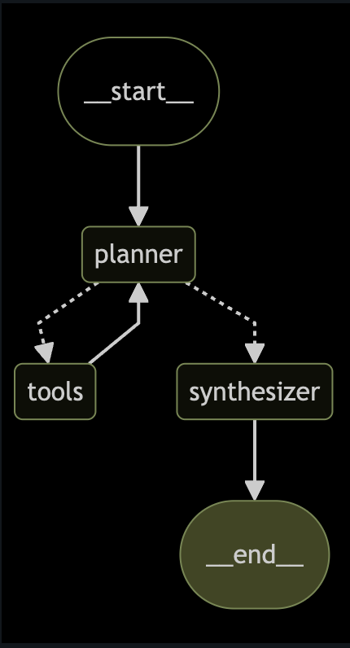

## A) Architecture (Design Approach):

### High‑Level Flow
  

### Design Approach
Planner–Executor–Synthesizer Pattern (Iterative Tool-Calling Agent)

This is a planner-driven agent architecture built using LangGraph. The Planner decides whether to call a tool, ask a clarification question, or stop. Tool calls are executed in a separate node, and the loop continues until the Planner decides enough information has been gathered. Then a Synthesizer generates the final structured response strictly from tool outputs.
I separated synthesis from planning to ensure clean responsibility boundaries. The planner focuses on orchestration logic, while the synthesizer focuses purely on generating a coherent, well-structured response grounded in tool outputs

#### Data sources + tool separation
I separated the two data sources into two tools with clear responsibilities:

1) **Policy RAG Tool**
- `retrieval.py` builds an **in-memory FAISS** vector index once per notebook session and then supports similarity search.
- Clean the markdown (remove noise)
- Split it into meaningful chunks (preserve section structure)
- Embed the chunks (Databricks embeddings endpoint)
- Store embeddings in FAISS (in-memory vector store)
- Provide search() methods so your policy tool can retrieve relevant snippets

2) **Flight Ops Tool**
- Queries `hive_metastore.default.ontime_cleaned` via Spark SQL to answer status, delay, timing, and route questions, using validated filters (flight/date/origin/dest) to prevent full-table scans.
- Used ontime_dictionary.txt during development to understand the schema and define safe column bundles (CORE + intent-based groups).
- Uses deterministic (keyword-based) intent detection and falls back to minimal CORE columns when needed to ensure robustness and avoid schema hallucination.

---

## B) Trade-offs (Demo vs Production)

#### 1. Vector store choice
**Demo:** FAISS (in-memory, zero infra, fastest to iterate in a notebook).  
**Production:** Databricks Vector Search (managed, scalable, UC governance, easier ops).

#### 2. SQL construction / security
**Demo:** SQL queries are built dynamically but only using predefined columns and filters that I manually validated. The allowed fields and conditions are somewhat controlled in code (hardcoded bundles).                
**Production:** Store the data dictionary in Unity Catalog as a governed Delta table and use it as a metadata-driven control layer to enforce allowlists, validate inputs, securely generate SQL, enable auditing, and enforce role-based access policies.

#### 3. Response Quality & Hallucination Control
**Demo:** Return the first LLM answer using top-k retrieved chunks, with minimal validation.                               
**Production** Add an answer validation loop (Self-RAG / Corrective RAG) that checks if the response is grounded in retrieved sources, triggers re-retrieval or query refinement when confidence is low, and enforces “cite or abstain” behavior to reduce hallucinations.

#### 4. Conversation memory
**Demo:** Keep last N messages in RAM.  
**Production:** Store long-term memory in an external persistent store and extract key facts or summaries from conversations into structured records. Retrieve relevant past context only when needed, and enforce retention, expiration, and privacy policies to manage cost and compliance.

#### 5. Scalability & Deployment
**Demo:** Run on a single interactive Databricks notebook/cluster with local state.                                
**Production:** Deploy model using Databricks Model Serving with built-in autoscaling for inference, while using autoscaling SQL Warehouses and Jobs clusters for data processing workloads.
